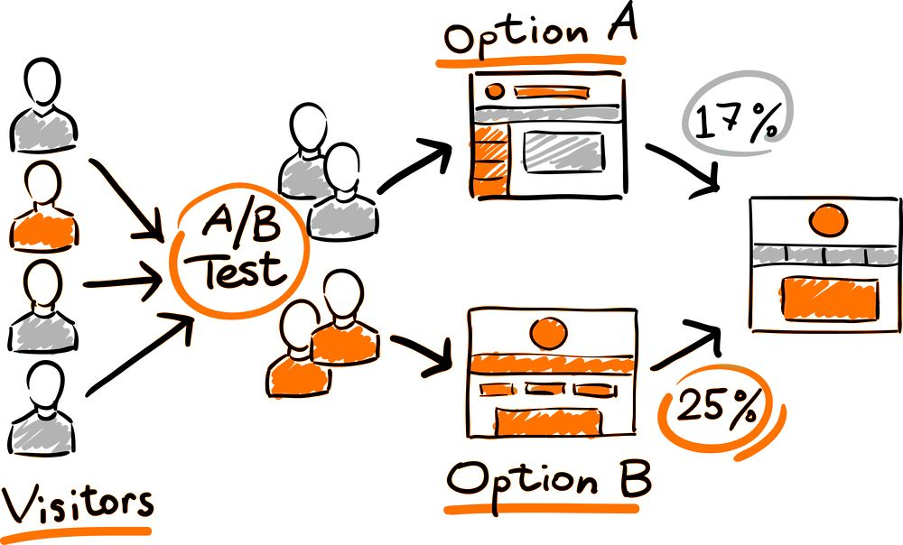

# Landing Page A/B Testing

💡 *Which page is s more effective at engaging potential customers.*

## Problem Statement
A company selling a high-value service wants to determine which of two web presentations is more effective at selling. Due to the high value and infrequent nature of the sales, as well as the lengthy sales cycle, it would take too long to accumulate enough sales data to identify the superior presentation. Therefore, the company uses a proxy variable to measure effectiveness. A proxy variable stands in for the true variable of interest, which may be unavailable, too costly, or too time-consuming to measure directly. In this case, the proxy variable is the amount of time users spend on a detailed interior page that describes the service.

## Data
The dataset includes a total of 36 sessions across the two web presentations: 21 sessions for page A and 15 sessions for page B. The goal is to determine if users spend more time on page B compared to page A. If users spend more time on page B, it would suggest that page B is more effective at engaging potential customers, and therefore, does a better selling job.

The time is expressed in hundredths of seconds. For example, a value of 0.1 indicates 10 seconds, and a value of 2.53 indicates 253 seconds.

## A/B Testing Process

## Result
In our analysis, the Mann-Whitney U test yielded a p-value of 0.22, indicating no statistically significant difference between the groups. However, the effect size (Cohen's d) was -0.37, suggesting a small to medium practical difference in outcomes between the two groups. Further investigation with a larger sample size may be warranted to explore this trend.
